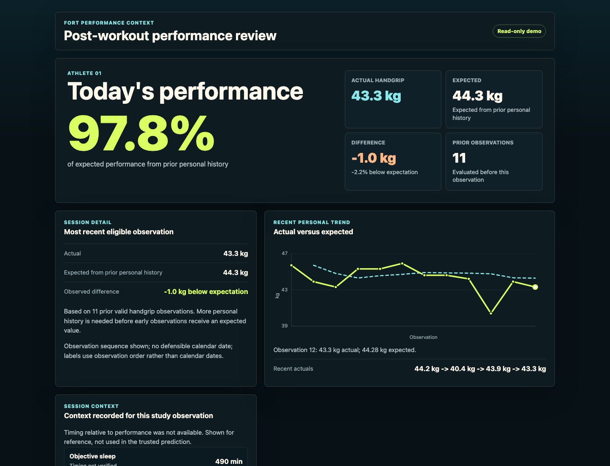

# Fort Performance Context

Leakage-aware REST handgrip modeling prototype with a read-only static product
demo.
## Live Demo

[View Fort Performance Context](https://fort-performance-context.vercel.app/)

The demo is deployed as a static Vite/React application on Vercel. No backend or live athlete ingestion is required.

## Product Demo

The frontend demo is a portfolio-style post-workout experience built only from
existing processed/model outputs. It has no authentication, no live athlete
ingestion, no backend persistence, no prospective context prediction, and no
individualized recommendations.



[View the mobile product demo screenshot](docs/assets/product-demo/product-demo-mobile-390.png).

Generate the static demo data:

```bash
python3 -m src.demo.build_demo_data
```

Install and run the frontend:

```bash
cd frontend
npm ci
npm run dev
```

Run tests:

```bash
python3 -m pytest tests/test_demo_data.py -q
python3 -m pytest -q

cd frontend
npm test
```

Build production assets:

```bash
cd frontend
npm run build
```

The frontend reads `frontend/public/data/demo.json` and does not read raw REST
files directly.
